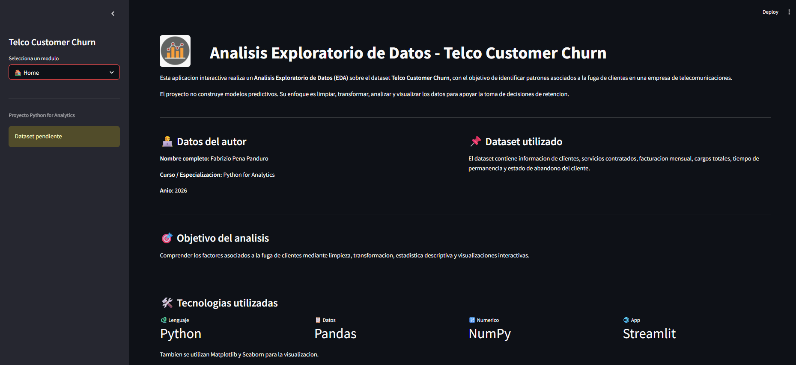
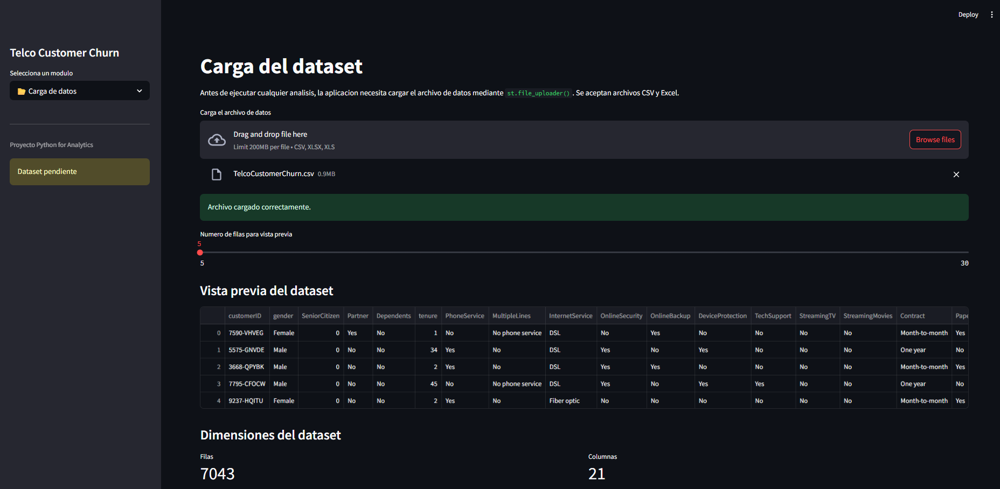
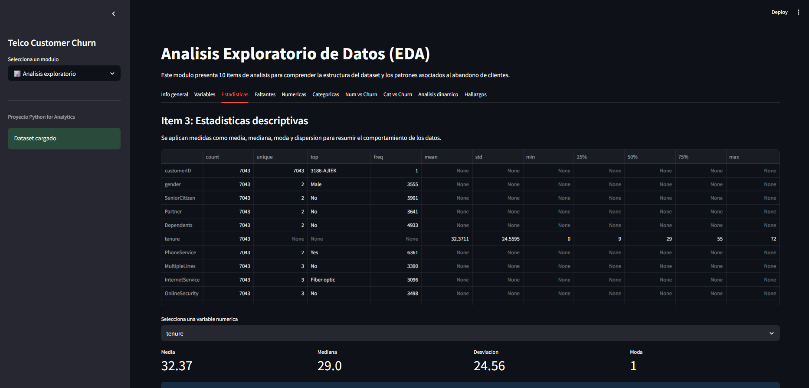
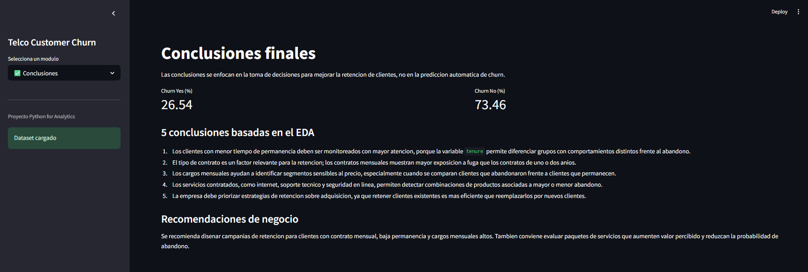

# Telco Customer Churn - Analisis Exploratorio de Datos

Proyecto final de la especializacion **Python for Analytics**. La aplicacion fue desarrollada en Python con Streamlit para realizar un Analisis Exploratorio de Datos (EDA) sobre el dataset `TelcoCustomerChurn.csv`.

## Descripcion del proyecto

El objetivo del proyecto es analizar, limpiar, transformar y visualizar informacion historica de clientes de una empresa de telecomunicaciones, identificando patrones asociados a la fuga de clientes o `churn`.

El enfoque del proyecto no es predictivo. La aplicacion busca apoyar la toma de decisiones mediante analisis exploratorio, estadistica descriptiva y visualizaciones interactivas.

## Tecnologias utilizadas

- Python
- Streamlit
- Pandas
- NumPy
- Matplotlib
- Seaborn

## Estructura de la aplicacion

- Home
- Carga de datos
- Limpieza y transformacion
- Analisis exploratorio
- Visualizaciones
- Conclusiones

## Analisis incluidos

La seccion EDA incluye 10 items:

1. Informacion general del dataset
2. Clasificacion de variables
3. Estadisticas descriptivas
4. Analisis de valores faltantes
5. Distribucion de variables numericas
6. Analisis de variables categoricas
7. Analisis bivariado numerico vs categorico
8. Analisis bivariado categorico vs categorico
9. Analisis dinamico basado en parametros seleccionados
10. Hallazgos clave

## Instrucciones de ejecucion

1. Clonar o descargar el repositorio.
2. Instalar dependencias:

```bash
pip install -r requirements.txt
```

3. Ejecutar la aplicacion:

```bash
streamlit run app.py
```

4. En la app, ingresar al modulo **Carga de datos** y cargar el archivo `TelcoCustomerChurn.csv`.

## Capturas de la app

Agregar aqui capturas de pantalla de:

### Home


### Carga de datos


### Analisis exploratorio


### Conclusiones


## Links relevantes

- Repositorio GitHub: https://github.com/Falex16/ProyectoEDA/tree/main/PROYECTO_II
- Aplicacion Streamlit Cloud: https://proyectoeda-nr2mqtqkogo6rrq2j7x9a2.streamlit.app

## Reflexion final

Este proyecto permite integrar conceptos fundamentales de Python, manipulacion de datos, visualizacion, estadistica descriptiva y construccion de aplicaciones interactivas. El resultado es una herramienta analitica funcional orientada a comprender factores relacionados con la fuga de clientes.
